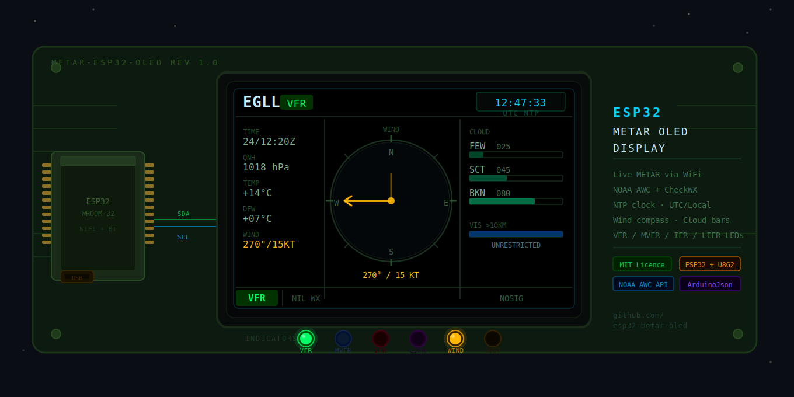

<div align="center">



# ✈️ ESP32 METAR OLED Display

**Live aviation weather. Animated compass. NTP clock. £8 of hardware.**

[](LICENSE)
[](https://www.espressif.com)
[](https://www.arduino.cc/en/software)
[](https://aviationweather.gov/data/api/)
[](CONTRIBUTING.md)

Fetches live METAR reports over WiFi · Decodes wind, cloud, visibility, QNH · Renders a pixel-accurate graphical display on a 128×64 OLED · Ticks an NTP-synced clock in the corner · Drives 5 flight-category LEDs

[**Try the browser simulator →**](simulator/metar_oled.html) · [Wiring guide](docs/wiring.md) · [Contributing](CONTRIBUTING.md)

</div>

---

## 📺 Display Preview

```
┌────────────────────────────────────────────────────────────────┐
│                                          ┌─────────────────┐  │
│  EGLL          VFR                       │  12:47:33  UTC  │  │
│ ─────────────────────────────────────────┴─────────────────┤  │
│                                                             │  │
│  ICAO   │  270°/15KT          CLOUD                        │  │
│  EGLL   │  ┌──────────┐       FEW 025  [██░░░░░░░░░░░░░]  │  │
│         │  │    N     │       SCT 045  [████░░░░░░░░░░░]  │  │
│  TIME   │  │    ↑     │       BKN 080  [████████░░░░░░░]  │  │
│  24th   │  │ W  +  E  │                                    │  │
│  12:20Z │  │          │       VIS   >10 KM                 │  │
│         │  │    S     │       [███████████████████████]   │  │
│  QNH    │  └──────────┘                                    │  │
│  1018   │                                                   │  │
│  hPa    │  No gusts                                        │  │
│         │                                                   │  │
│  T +14° │                                                   │  │
│  D  +07°│                                                   │  │
├─────────┴───────────────────────────────────────────────────┤  │
│  VFR  │  NIL WX                                  NOSIG      │  │
└────────────────────────────────────────────────────────────────┘

  ● VFR   ○ MVFR   ○ IFR   ○ LIFR        ○ WIND   ○ GUST
```

The right panel shows the OLED canvas. LEDs below are driven by GPIO pins.

---

## 🌦️ What is a METAR?

A **METAR** (Meteorological Aerodrome Report) is the worldwide standard format for reporting current weather conditions at an airport. Issued every 30 minutes, they are used by pilots worldwide for flight planning and by ATC for separation. Every airport with an ICAO code publishes one.

### Anatomy of a METAR

```
METAR EGLL 241220Z 27015G25KT 9999 FEW025 BKN045 14/07 Q1018 NOSIG
  │     │      │       │        │      │      │     │    │     │
  │     │      │       │        │      │      │     │    │     └─ No significant change expected
  │     │      │       │        │      │      │     │    └─ QNH 1018 hPa (altimeter setting)
  │     │      │       │        │      │      │     └─ Temperature +14°C / Dewpoint +7°C
  │     │      │       │        │      │      └─ Broken cloud base at 4,500 ft
  │     │      │       │        │      └─ Few clouds at 2,500 ft
  │     │      │       │        └─ Visibility 9,999m (10km+, unrestricted)
  │     │      │       └─ Wind: 270° (westerly) at 15 knots, gusting 25 knots
  │     │      └─ Date/time: 24th of month, 12:20 UTC (Zulu)
  │     └─ Station: London Heathrow (ICAO code)
  └─ Report type: Routine METAR (vs SPECI = special report)
```

### Common UK Airport ICAO Codes

| ICAO | Airport | City |
|:----:|---------|------|
| `EGLL` | Heathrow | London |
| `EGKK` | Gatwick | London |
| `EGLC` | London City | London |
| `EGSS` | Stansted | London |
| `EGCC` | Manchester | Manchester |
| `EGPH` | Edinburgh | Edinburgh |
| `EGPD` | Aberdeen | Aberdeen |
| `EGNX` | East Midlands | Nottingham |
| `EGBB` | Birmingham | Birmingham |
| `EGFF` | Cardiff | Cardiff |

### Common US Airport ICAO Codes

| ICAO | Airport | City |
|:----:|---------|------|
| `KJFK` | John F. Kennedy | New York |
| `KLAX` | Los Angeles Intl | Los Angeles |
| `KORD` | O'Hare | Chicago |
| `KATL` | Hartsfield-Jackson | Atlanta |
| `KSFO` | San Francisco | San Francisco |
| `KBOS` | Logan | Boston |
| `KDFW` | Dallas/Fort Worth | Dallas |
| `KDEN` | Denver Intl | Denver |

---

## 🚦 Flight Categories

The display and LEDs indicate one of four ICAO/FAA flight categories, derived from ceiling and visibility:

| Category | LED Colour | Ceiling | Visibility | Meaning |
|:---:|:---:|:---:|:---:|---|
|  | 🟢 Green | ≥ 3,000 ft | ≥ 5 km | Visual Flight Rules — clear enough to fly by sight |
|  | 🔵 Blue | 1,000–2,999 ft | 1.6–4.9 km | Marginal VFR — flyable but degraded |
|  | 🔴 Red | 300–999 ft | 800 m–1.5 km | Instrument Flight Rules — instruments required |
|  | 🟣 Purple | < 300 ft | < 800 m | Low IFR — severe restriction, approach limits exceeded |

The amber **WIND** LED lights on sustained wind ≥ 15 kt or gusts ≥ 25 kt.

---

## 🔍 METAR Examples Decoded

<details>
<summary><b>Example 1 — VFR, light winds, clear skies (EGLL)</b></summary>

```
METAR EGLL 241220Z 27015KT 9999 FEW025 14/07 Q1018 NOSIG
```

| Field | Value | Meaning |
|---|---|---|
| Station | `EGLL` | London Heathrow |
| Time | `241220Z` | 24th, 12:20 UTC |
| Wind | `27015KT` | 270° (W) at 15 kt |
| Visibility | `9999` | 10 km+ unrestricted |
| Cloud | `FEW025` | Few clouds at 2,500 ft |
| Temp/Dew | `14/07` | +14°C / +7°C |
| QNH | `Q1018` | 1018 hPa |
| Trend | `NOSIG` | No significant change |
| **Category** | **VFR 🟢** | Clear day, visual flying |

</details>

<details>
<summary><b>Example 2 — IFR, rain, low cloud (EGNX)</b></summary>

```
METAR EGNX 241300Z 19020KT 3500 -RA BKN006 OVC012 10/09 Q1005
```

| Field | Value | Meaning |
|---|---|---|
| Station | `EGNX` | East Midlands Airport |
| Wind | `19020KT` | 190° (S) at 20 kt |
| Visibility | `3500` | 3,500 m — restricted |
| Weather | `-RA` | Light rain |
| Cloud | `BKN006 OVC012` | Broken 600 ft, overcast 1,200 ft |
| Temp/Dew | `10/09` | +10°C / +9°C — near saturation |
| QNH | `Q1005` | Low pressure system |
| **Category** | **IFR 🔴** | Instruments required |

</details>

<details>
<summary><b>Example 3 — LIFR, fog (EGPD)</b></summary>

```
METAR EGPD 241230Z 05004KT 0400 FG OVC001 09/09 Q1015
```

| Field | Value | Meaning |
|---|---|---|
| Station | `EGPD` | Aberdeen Airport |
| Wind | `05004KT` | Near calm |
| Visibility | `0400` | 400 m — severe fog |
| Weather | `FG` | Fog |
| Cloud | `OVC001` | Overcast at 100 ft |
| Temp/Dew | `09/09` | Dewpoint = temp → fog forming |
| **Category** | **LIFR 🟣** | Airport likely closed |

</details>

<details>
<summary><b>Example 4 — Thunderstorm, gusting (EGSS)</b></summary>

```
METAR EGSS 241410Z 30025G41KT 8000 +TSRA SCT015CB BKN035 19/14 Q0998
```

| Field | Value | Meaning |
|---|---|---|
| Station | `EGSS` | London Stansted |
| Wind | `30025G41KT` | 300° at 25 kt, **gusting 41 kt** |
| Visibility | `8000` | 8 km — rain reducing vis |
| Weather | `+TSRA` | **Heavy** thunderstorm + rain |
| Cloud | `SCT015CB` | Scattered cumulonimbus at 1,500 ft ⚡ |
| QNH | `Q0998` | Deep low pressure |
| **Category** | **MVFR 🔵** + WIND ⚠️ | Technically MVFR but CB present |

</details>

---

## 🛒 Hardware Bill of Materials

| # | Component | Spec | Where to buy | Est. cost |
|:---:|---|---|---|:---:|
| 1 | **ESP32 Dev Module** | ESP32-WROOM-32, 30-pin | Amazon / AliExpress | £3–5 |
| 2 | **OLED Display** | SH1106 128×64 I2C 1.3" (white) | Amazon / Pimoroni | £3–4 |
| — | *or alternative* | SSD1306 128×64 I2C 0.96" | Amazon | £2–3 |
| 3 | **LEDs × 5** | 3mm or 5mm: green, blue, red, purple, amber | Amazon (assortment) | < £1 |
| 4 | **Resistors × 5** | 220 Ω ¼W | Amazon (assortment pack) | < £1 |
| 5 | **Breadboard** | 400-tie half-size | Amazon / Pimoroni | £1–2 |
| 6 | **Jumper wires** | Male-to-male, 20cm | Amazon | £1–2 |
| 7 | **USB cable** | Micro-USB or USB-C (matches your board) | Any | £1 |

**Total: approximately £10–15**

> 💡 **UK sources:** [Pimoroni](https://shop.pimoroni.com), [The Pi Hut](https://thepihut.com), [Rapid Electronics](https://www.rapidonline.com)
> 🌍 **US sources:** [Adafruit](https://www.adafruit.com), [SparkFun](https://www.sparkfun.com), [DigiKey](https://www.digikey.com)

---

## ⚡ Quick Start

### 1 — Try it in the browser (no hardware needed)

```bash
# Clone the repo
git clone https://github.com/YOUR-USERNAME/esp32-metar-oled.git

# Open the simulator
open simulator/metar_oled.html     # macOS
xdg-open simulator/metar_oled.html # Linux
# Or just double-click the file in Windows Explorer
```

Paste any raw METAR string, hit **DECODE + RENDER**, and watch the OLED come alive.

### 2 — Flash to ESP32

**Install Arduino IDE 2.x** → [arduino.cc/en/software](https://www.arduino.cc/en/software)

**Add ESP32 board support:**
> File → Preferences → Additional Boards Manager URLs → paste:
> ```
> https://raw.githubusercontent.com/espressif/arduino-esp32/gh-pages/package_esp32_index.json
> ```
> Tools → Board → Boards Manager → search `esp32` → install **esp32 by Espressif Systems**

**Install libraries** (Tools → Manage Libraries):
- `U8g2` by olikraus
- `ArduinoJson` by Benoit Blanchon

**Edit `firmware/metar_esp32.ino`** — set your credentials at the top:

```cpp
const char* WIFI_SSID     = "YOUR_WIFI_NAME";
const char* WIFI_PASSWORD = "YOUR_WIFI_PASSWORD";
const char* STATIONS      = "EGLL,EGPH,KJFK";   // comma-separated, up to 8
```

**Select board:** Tools → Board → ESP32 Arduino → **ESP32 Dev Module**

**Upload** → open Serial Monitor at 115200 baud → watch it boot:

```
=== METAR DISPLAY ESP32 ===
Connecting to MyWiFi ....
Connected! IP: 192.168.1.42
NTP sync OK — pool.ntp.org
[NOAA] Fetching METAR for EGLL...
[NOAA] OK — EGLL  CAT:VFR  T:+14  Wind:270/15KT  VIS:9999m
```

---

## 🔌 Wiring

See the full wiring guide with ASCII circuit diagram → **[docs/wiring.md](docs/wiring.md)**

### Quick reference

```
ESP32                 SH1106 OLED
──────────────────────────────────
3.3V  ──────────────► VCC
GND   ──────────────► GND
GPIO 22 (SCL) ──────► SCL
GPIO 21 (SDA) ──────► SDA


ESP32         220Ω    LED         
──────────────────────────────────
GPIO 2  ──── [R] ──── GREEN  ── GND   ← VFR
GPIO 4  ──── [R] ──── BLUE   ── GND   ← MVFR
GPIO 5  ──── [R] ──── RED    ── GND   ← IFR
GPIO 18 ──── [R] ──── PURPLE ── GND   ← LIFR
GPIO 19 ──── [R] ──── AMBER  ── GND   ← WIND ≥ 15kt
```

> ⚠️ **OLED must be on 3.3V — not 5V.** The ESP32 is a 3.3V device throughout.

---

## 🌐 APIs Used

### NOAA Aviation Weather Centre *(primary — completely free)*

```
GET https://aviationweather.gov/api/data/metar?ids=EGLL&format=json
```

- ✅ No API key, no registration
- ✅ Worldwide coverage — UK, US, and all ICAO airports
- ✅ Rate limit: 100 requests/minute (generous for IoT use)
- ✅ Returns JSON — wind, visibility, clouds, temp, QNH, flight category
- 📋 [API documentation](https://aviationweather.gov/data/api/)

### CheckWX *(optional fallback — free tier)*

```
GET https://api.checkwx.com/metar/EGLL/decoded
Header: X-API-Key: YOUR_KEY
```

- ✅ Free tier: 100 calls/hour
- ✅ Returns fully decoded JSON with unit conversions
- ✅ Richer weather phenomena decoding
- 🔑 Sign up (no credit card): [checkwxapi.com](https://checkwxapi.com)

Leave `CHECKWX_API_KEY = ""` to use NOAA only — the sketch will never try CheckWX.

---

## 🕐 NTP Clock

The ESP32 syncs time from `pool.ntp.org` immediately after WiFi connects. Three servers are tried in order:

```
pool.ntp.org  →  uk.pool.ntp.org  →  time.google.com
```

The clock renders in the top-right corner of the OLED in `HH:MM:SS` format, updating every second.

**Timezone configuration** in the sketch:

| Location | `GMT_OFFSET_SEC` | `DAYLIGHT_OFFSET_SEC` |
|---|:---:|:---:|
| UK — UTC always | `0` | `0` |
| UK — auto BST (recommended) | `0` | `3600` |
| US Eastern EST/EDT | `-18000` | `3600` |
| US Central CST/CDT | `-21600` | `3600` |
| US Mountain MST/MDT | `-25200` | `3600` |
| US Pacific PST/PDT | `-28800` | `3600` |
| Central Europe CET/CEST | `3600` | `3600` |

---

## 📁 Repository Structure

```
esp32-metar-oled/
│
├── 📄 README.md                 ← you are here
├── 📄 LICENSE                   ← MIT
├── 📄 CONTRIBUTING.md           ← how to contribute
├── 📄 .gitignore                ← C++ + Arduino + ESP32 toolchain
│
├── 📂 firmware/
│   └── metar_esp32.ino          ← ESP32 Arduino sketch
│
├── 📂 simulator/
│   └── metar_oled.html          ← browser OLED simulator (no hardware needed)
│
└── 📂 docs/
    ├── wiring.md                ← pin connections + ASCII circuit diagram
    └── screenshots/             ← add photos of your build here
```

---

## 🖥️ OLED Module Compatibility

Change one line in the sketch to match your display:

```cpp
// SH1106 128×64 — 1.3" white or blue OLED  ← default
U8G2_SH1106_128X64_NONAME_F_HW_I2C u8g2(U8G2_R0, U8X8_PIN_NONE, OLED_SCL, OLED_SDA);

// SSD1306 128×64 — 0.96" OLED
// U8G2_SSD1306_128X64_NONAME_F_HW_I2C u8g2(U8G2_R0, U8X8_PIN_NONE, OLED_SCL, OLED_SDA);

// SSD1309 128×64 — 2.4" larger OLED
// U8G2_SSD1309_128X64_NONAME0_F_HW_I2C u8g2(U8G2_R0, U8X8_PIN_NONE, OLED_SCL, OLED_SDA);
```

Supported I2C addresses: `0x3C` (default) or `0x3D` — set via `OLED_ADDR` in the sketch.

---

## 🛠️ Troubleshooting

| Symptom | Cause | Fix |
|---|---|---|
| OLED stays blank | Wrong I2C address | Try `0x3D` instead of `0x3C` |
| OLED stays blank | Wrong driver selected | Uncomment the correct `U8G2_*` line |
| Display garbled | SDA/SCL swapped | Check GPIO 21 = SDA, GPIO 22 = SCL |
| WiFi won't connect | 5 GHz network | ESP32 is **2.4 GHz only** |
| NOAA returns empty | Wrong ICAO | Use ICAO not IATA — `EGLL` not `LHR` |
| HTTPS error | Certificate issue | Add `client.setInsecure()` after `WiFiClientSecure client;` |
| NTP timeout | UDP 123 blocked | Check router firewall; try `time.google.com` as primary |
| LEDs not lighting | Wrong GPIO | Check `#define LED_*` matches your wiring |
| Sketch won't compile | ArduinoJson version | v6 or v7 both work — check syntax matches |

---

## 🗺️ Roadmap

Ideas and planned features — contributions welcome:

- [ ] **TAF forecast** — second display page showing terminal forecast
- [ ] **Web config portal** — set WiFi and stations via browser, no reflashing
- [ ] **Button cycling** — single pushbutton to step through stations
- [ ] **SIGMET / AIRMET alert** — amber flash on active significant met
- [ ] **Deep sleep** — battery-powered portable unit, wake every 30 min
- [ ] **PCB design** — KiCad schematic and board layout
- [ ] **METAR trend history** — sparkline of last 6 readings per station
- [ ] **Dual OLED** — second display for TAF alongside live METAR

See [CONTRIBUTING.md](CONTRIBUTING.md) for how to get involved.

---

## 🤝 Contributing

Pull requests are welcome. For major changes, open an issue first. See [CONTRIBUTING.md](CONTRIBUTING.md) for the full guide.

```bash
# Fork, clone, branch
git checkout -b feature/my-new-thing

# Make changes, test, commit
git commit -m "Add: TAF second screen"

# Push and open a PR
git push origin feature/my-new-thing
```

---

## 📜 Licence

```
MIT License — Copyright (c) 2026

Permission is hereby granted, free of charge, to any person obtaining a copy
of this software and associated documentation files, to deal in the Software
without restriction, including without limitation the rights to use, copy,
modify, merge, publish, distribute, sublicense, and/or sell copies of the
Software, subject to the following conditions: the above copyright notice and
this permission notice shall be included in all copies or substantial portions
of the Software.
```

---

## 🙏 Acknowledgements

| Project | Author | Used for |
|---|---|---|
| [U8g2](https://github.com/olikraus/u8g2) | olikraus | OLED display driver |
| [ArduinoJson](https://arduinojson.org) | Benoit Blanchon | JSON parsing on microcontrollers |
| [arduino-esp32](https://github.com/espressif/arduino-esp32) | Espressif Systems | ESP32 Arduino core |
| [NOAA AWC](https://aviationweather.gov) | US National Weather Service | Free METAR API |
| [CheckWX](https://checkwxapi.com) | CheckWX | Decoded METAR API |

---

<div align="center">

**Built for pilots, RC flyers, aviation enthusiasts, and makers**

⭐ Star this repo if you build one · 📸 Share your build in [Issues](../../issues)

</div>
